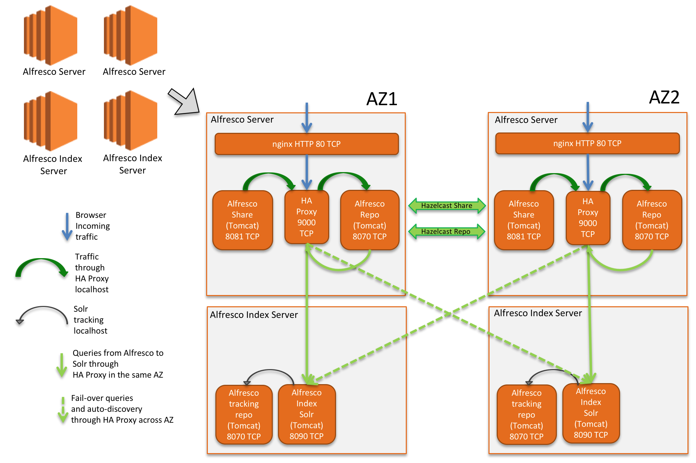

Alfresco CloudFormation Template with Chef
==========================================

*Notes:*
* Extensive documentation about how to use this template will be available soon at http://aws.amazon.com/quiskstart/community
* GovCloud and China regions are not supported in this release.

*Demo:* Watch a 6' minutes demo here <LINK SOON>

Overview
--------------------

This template will instantiate a 2-node Alfresco cluster with 2 dedicated Index servers the following capabilities:
* All Alfresco and Index nodes will be placed inside a Virtual Private Cloud (VPC) each node in a different AZ, same Region.
* An Elastic Load Balancer instance with "sticky" sessions based on the Tomcat JSESSIONID.
* Shared S3 ContentStore
* MySQL database on RDS instances in Multi-AZ mode.
* Each Alfresco and Index node will be in a separate Availability Zone.
* We use a pre-baked AMI. Our official Alfresco One AMI published in the AWS Marketplace, based on CentOS7.
* Auto-scaling rules that will add extra Alfresco and Index nodes when certain performance thresholds are reached.
* Result of the AWS CloudFormation template deployment:

Requirements
-----------
* An AWS Account with privileges to create resources
* BYOL or Alfresco One trial license with cluster supported (contact Alfresco Sales if needed)
* Subscribe to CentOS7 AMI in AWS Marketplace (more details below)
* Alfresco CloudFormation template that you can find in this GitHub repo.

Basic Usage
-----------
There are a number of tasks that you must complete as part of the deployment.

Before launching the AWS CloudFormation template, you must:
* Create an Amazon EC2 key pair
	* The Amazon EC2 key pair provides SSH access to the instances created by the AWS CloudFormation template. If you already have a key pair you would like to use, you can skip this step.  
To create a key pair, use the instructions on https://docs.aws.amazon.com/AWSEC2/latest/UserGuide/ec2-key-pairs.html.
* Accept terms to use the CentOS 7 AMI from the AWS Market.
	* Alfresco One and its index servers use CentOS 7 as base operating systems for this environment. To be able to use the CentOS 7 AMI, accept the use conditions from this page (login to your AWS account): https://aws.amazon.com/marketplace/pp/B00O7WM7QW
Click Continue. You’ll then see the Launch on EC2 page. Finally, select the Manual Launch tab, and then click Accept Terms.
* Launch the [AWS Console](http://aws.amazon.com/console/cloudformation)
* Click *Create Stack*.
* Name and upload the Alfresco CloudFormation Template.
* Click *Continue*.
* Fill out the form making sure you review the following:
	* Ask for your trial license to your Alfresco Sales representative or Alfresco Support.
	* Ensure you use the name of an unique S3 bucket to be created.
	* Verify the instance sizes and be mindful of the hourly costs (that can be reviewed in the next section).
	* Provide the logins and passwords for the database and Alfresco admin accounts. These accounts and passwords will be created & set by the template.
	* Ensure you set the correct EC2 key.
* Click *Continue* and finish the wizard.

Tips
----
* The stack will take around 20 minutes to COMPLETE, but then you need another 20 minutes to have Alfresco One available (it depends on the AWS Region and instance types because Alfresco and its components has to be reconfigured and started).
* Use the *Events* tab to review status and any errors.
* Once the environment starts, use the *Output* tab to get the URL of the load-balancer.
* If stack deletion does not complete and the *Events* show an error related to VPC, login to the VPC console and delete the corresponding VPC; then delete the stack again.
* Internals of the deployment:

Considerations for Production Environments
------------------------------------------
* Do a proper Sizing based on https://www.alfresco.com/resources/whitepapers/alfresco-one-51-sizing-guide
* Choose proper instance type (EC2/RDS)
* Choose proper number of nodes for your deployment
* Index storage, proper EBS volumes must be set on index instances, it has ephemeral storage by default
* HTTPS is not set in ELB as endpoint but it is allowed by default in Security Groups
* Autoscaling custom setup is set by default based on CPU
* General Testing / Upgrades
* No OS Hardening for NAT and Servers is in place
* Solr 4 in Alfresco 5.1 has not applied any specific tuning, i.e.: rerank or sharding
* CloudFront WAF is not included

License
-------
   Copyright 2016 Alfresco Software, Ltd.
   Copyright 2016 Amazon Web Services, Inc.

   Licensed under the Apache License, Version 2.0 (the "License");
   you may not use this file except in compliance with the License.
   You may obtain a copy of the License at

       http://www.apache.org/licenses/LICENSE-2.0

This work may reference software licensed under other open source licenses, please refer to these respective works for more information on license terms.
